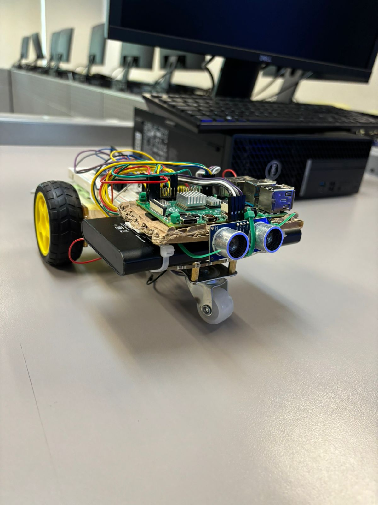
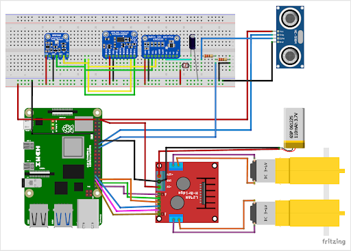
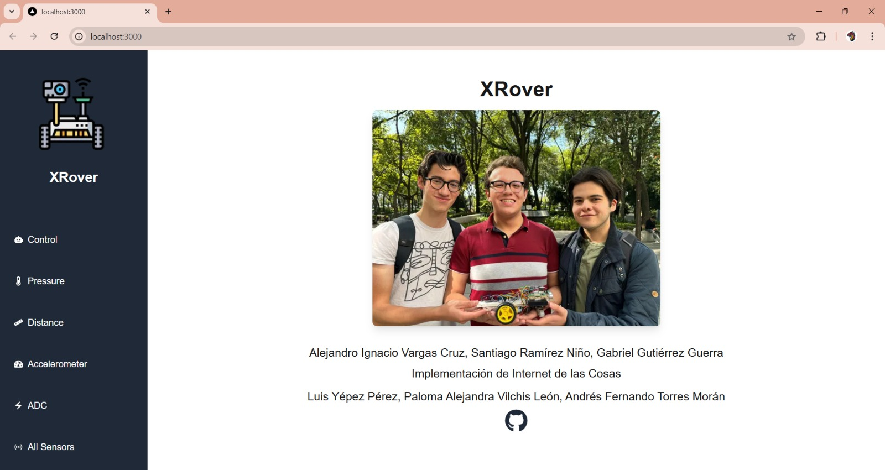
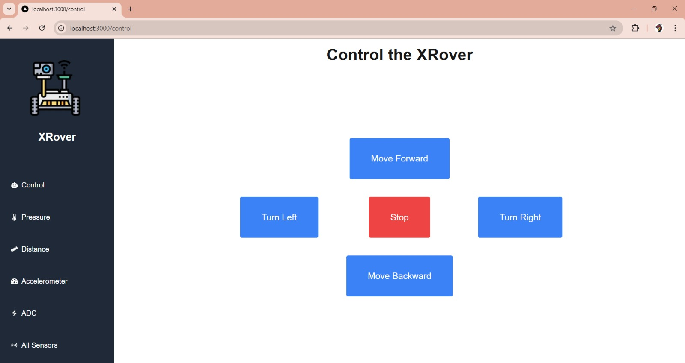
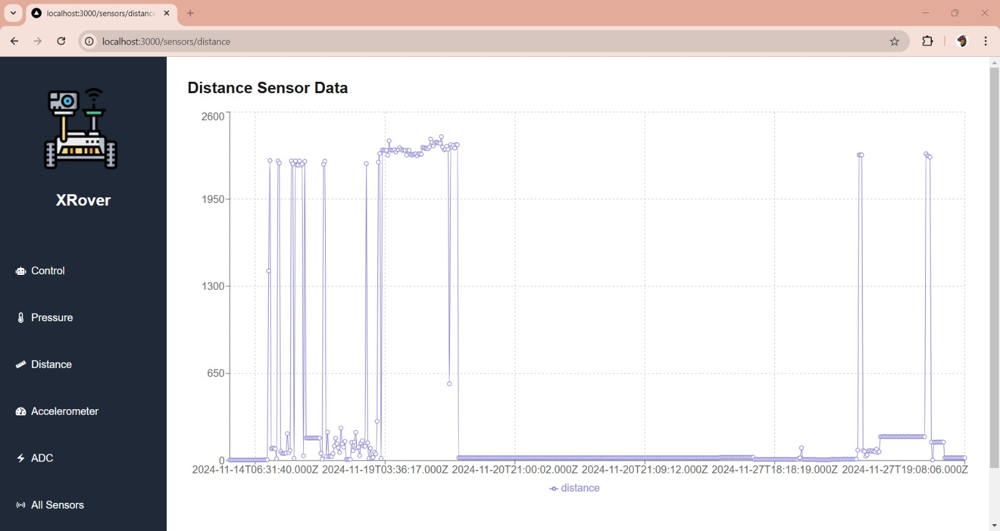
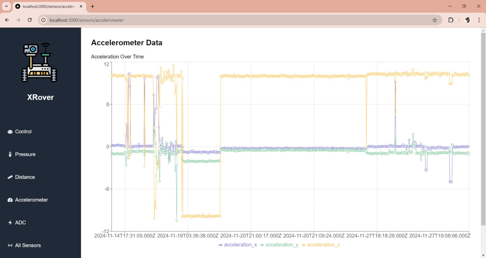
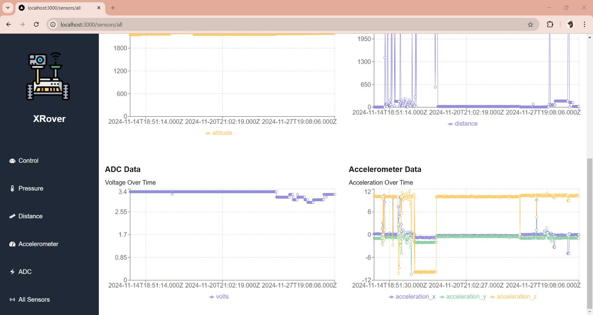

# XRover

## Description

XRover is an autonomous rover project with sensor integration. The rover is designed to move and collect data from various sensors, including an accelerometer, pressure sensor, distance sensor, and ADC (Analog-to-Digital Converter). The data is sent via MQTT and visualized in a web application.

[](https://www.youtube.com/shorts/KBhfExidcCY)

## Features

- **Remote Control**: Control the rover remotely using a web application.
- **Integrated Sensors**:
  - Accelerometer: Measures acceleration in the X, Y, and Z axes.
  - Pressure Sensor: Measures pressure, temperature, and altitude.
  - Distance Sensor: Measures the distance to objects.
  - ADC: Converts analog signals to digital.
- **Data Visualization**: Visualize sensor data in real-time in the web application.
- **MQTT**: Uses MQTT for communication between the rover and the web application.

## Requirements

- Raspberry Pi with Raspbian installed
- Compatible sensors (Accelerometer, Pressure Sensor, Distance Sensor, ADC)
- Python 3
- Node.js and npm
- MQTT Broker (e.g., HiveMQ)

##  Rover Setup

1. Clone the repository on your Raspberry Pi:
```
   git clone https://github.com/tu-usuario/xrover.git
   cd xrover
```
2. Configure the GPIO pins and connect the sensors according to the wiring diagram.


3. Run the motor control script:
```
    python motor.py
```

4. Run the data listener script:
```    
    python listener.py
```

## Web Application Setup

1. Navigate to the web application directory:
```
    cd web/xrover-web
```

2. Install Node.js dependencies:
```
    npm install
```

3. Start the web application:
```
    npm run dev
```

4. Open your browser and navigate to http://localhost:3000 to view the application.


## Usage

### Rover Control

1. Open the web application in your browser.
2. Navigate to the control page (/control).
3. Use the buttons to move the rover forward, backward, left, right, or stop.


### Data Visualization
1. Open the web application in your browser.
2. Navigate to the sensor pages (/sensors/pressure, /sensors/distance, /sensors/accelerometer, /sensors/adc).
3. Visualize the sensor data in real-time.







## Contributors
Alejandro Ignacio Vargas Cruz - [GitHub Profile](https://github.com/AlexNachoVC) <br>
Gabriel Gutiérrez Guerra - [GitHub Profile](https://github.com/gaboggawewe) <br>
Santiago Ramírez Niño - [GitHub Profile](https://github.com/SantiagoNinoX) <br>

